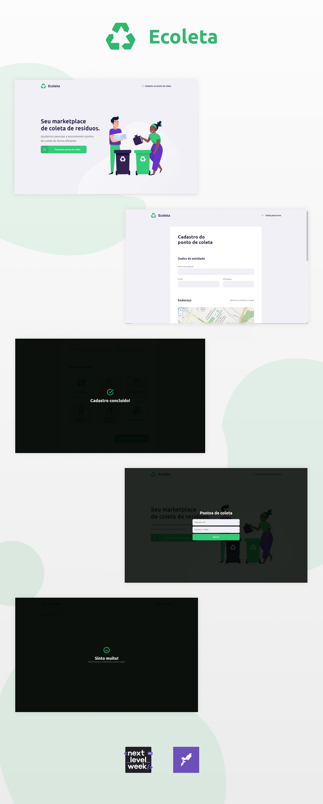

<h4 align="center">
  :recycle: Ecoleta
</h4>
 
 
 

  :computer: <a href="#computer-tecnologias">Tecnologias</a>

    

 
 

## :computer: Tecnologias
- [Node.js](https://nodejs.org/en/)
- [Express](https://expressjs.com/pt-br/)
- [Knex](http://knexjs.org/)
- [Sqlite3](https://www.sqlite.org/index.html)
- [Typescript](https://www.typescriptlang.org/)
- [ReactJS](https://pt-br.reactjs.org/), [Create React App](https://github.com/facebook/create-react-app) 
- [Sass](https://sass-lang.com/)
- [Axios](https://sass-lang.com/)

 
 

<h5 align="center">
  :heart: Desenvolvido por Julianne Volotão.
</h5>

 
 
